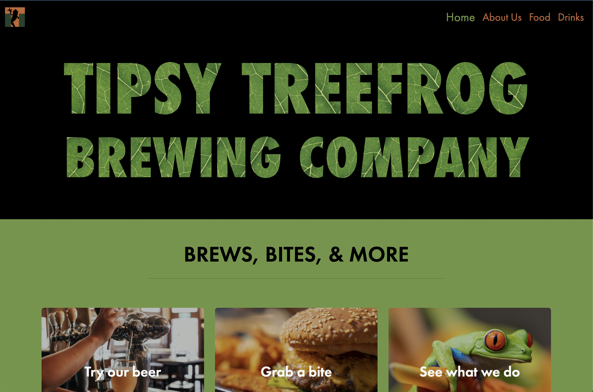
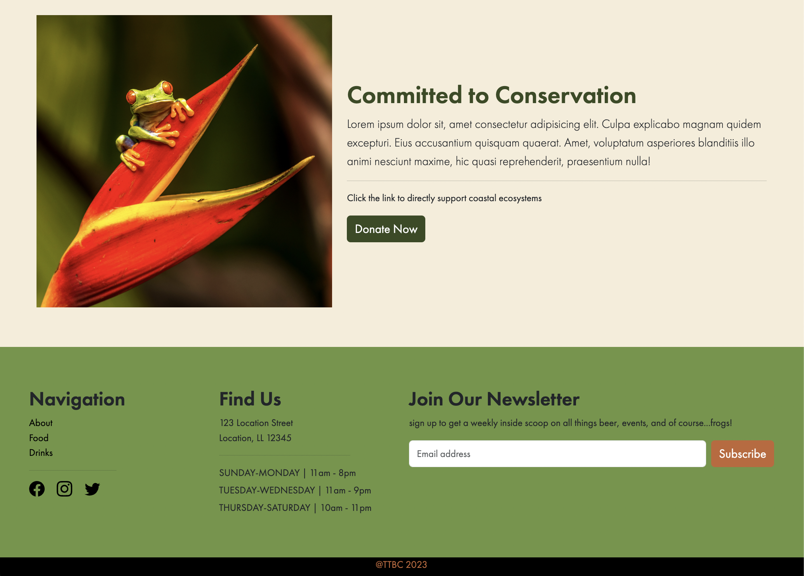

 

  

<h1 align="center">Tipsy Treefrog Brewing Company</h1>

    Mockup website for a fun, nature-loving brewery 🍺
  

  

    <a href="https://tipsytreefrog.netlify.app/"><strong>Visit the TTBC Website »</strong></a>
  

  
Table of Contents

  <ul>
    <li><a href="#about-the-project">About</a></li>
    <li><a href="#built-with">Built With</a></li>
    <li><a href="#roadmap">Road Map</a></li>
    <li><a href="#contact-me">Contact Me</a></li>
  </ul>

## About The Project
The tipsy tree frog website is a front end mock-up site for a brewing company. It has custom designed graphics, products, and a fully responsive layout that covers small mobile devices to larger screens and desktops.

## Built With
![HTML5][html-shield]
![CSS3][css-shield]
![JavaScript][js-shield]
[![Bootstrap][bootstrap-shield]][bootstrap-url]
[![Adobe Photoshop][adobeps-shield]][adobeps-url]
[![Canva][canva-shield]][canva-url]

At this point in time, TTBC is a purely front end application with future plans to add an admin-editable backend and database.  For the initial design of the site, the layout is built upon Bootstrap CSS and JavaScript. Animated scroll effects were added to give the website a fun, dynamic feel as users are scrolling through the pages.

All of the graphics on the site are custom-made using Adobe Suite and Canva services. The tree frog logo boast the site’s colors to create a solid and unified business brand. I’m addition, the can design is also conceptualized with the brand and company themes in mind.

### Color Reference

| Color             | Hex                                                                |
| ----------------- | ------------------------------------------------------------------ |
| Dark Green |  #384B22 |
| Burnt Orange |  #C26637 |
| Light Green |  #6F9543 |
| Tan Cream|  #F6EDD9 |
| Black |  #00d1a0 |
| White|  #ffffff |

## Roadmap

- Remove PDF menu docs and add dynamic food menu page 
- Add admin functionality for editing and updating the website
- Online order capability and user login authentication to save order information
- Add shop page for TTBC merchandise and beverages

## Contact Me

View my Portfolio: [![portfolio][portfolio-shield]][portfolio-url]

Shoot me an Email: ka.lange266@gmail.com

Find me on Twitter: [![twitter][twitter-shield]][twitter-url]

Connect on Linked In: [![linkedIn][linkedin-shield]][linkedin-url]

(<a href="#readme-top">back to top</a>)

<!-- MARKDOWN LINKS & IMAGES -->
<!-- https://www.markdownguide.org/basic-syntax/#reference-style-links -->
[html-shield]: https://img.shields.io/badge/html5-%23E34F26.svg?style=for-the-badge&logo=html5&logoColor=white

[css-shield]: https://img.shields.io/badge/css3-%231572B6.svg?style=for-the-badge&logo=css3&logoColor=white

[js-shield]: https://img.shields.io/badge/javascript-%23323330.svg?style=for-the-badge&logo=javascript&logoColor=%23F7DF1E
[ejs-shield]: https://img.shields.io/badge/EJS-100000?style=for-the-badge&logo=EJS&logoColor=white&labelColor=ffffff&color=B8C972

[bootstrap-shield]: https://img.shields.io/badge/bootstrap-%238511FA.svg?style=for-the-badge&logo=bootstrap&logoColor=white
[bootstrap-url]: https://getbootstrap.com

[express-shield]: https://img.shields.io/badge/express.js-%23404d59.svg?style=for-the-badge&logo=express&logoColor=%2361DAFB
[express-url]: https://expressjs.com/

[node-shield]: https://img.shields.io/badge/node.js-6DA55F?style=for-the-badge&logo=node.js&logoColor=white
[node-url]: https://nodejs.org/en

[mongodb-shield]: https://img.shields.io/badge/MongoDB-%234ea94b.svg?style=for-the-badge&logo=mongodb&logoColor=white
[mongodb-url]: https://www.mongodb.com/

[ejs-shield]:https://img.shields.io/badge/EJS-100000?style=for-the-badge&logo=EJS&logoColor=white&labelColor=B8C972&color=B8C972
[ejs-url]:https://ejs.co/

[canva-shield]: https://img.shields.io/badge/Canva-%2300C4CC.svg?style=for-the-badge&logo=Canva&logoColor=white
[canva-url]: https://www.canva.com/

[adobeps-shield]:https://img.shields.io/badge/adobe%20photoshop-%2331A8FF.svg?style=for-the-badge&logo=adobe%20photoshop&logoColor=white
[adobeps-url]:https://www.adobe.com/products/photoshop/landpa.html?sdid=KKQIN&mv=search&kw=photoshop&ef_id=Cj0KCQjw9fqnBhDSARIsAHlcQYR9qXBGk9qu_aDS7PDLWhOo3f9376A2DhbkZ_Uza2shfSs7uc-4H9gaAt0pEALw_wcB:G:s&s_kwcid=AL!3085!3!522507805137!e!!g!!adobe%20photoshop!1712238394!67643541820&mv=search&gclid=Cj0KCQjw9fqnBhDSARIsAHlcQYR9qXBGk9qu_aDS7PDLWhOo3f9376A2DhbkZ_Uza2shfSs7uc-4H9gaAt0pEALw_wcB

[linkedin-shield]: https://img.shields.io/badge/linkedin-%230077B5.svg?style=for-the-badge&logo=linkedin&logoColor=white
[linkedin-url]: https://www.linkedin.com/in/ka-lange/

[twitter-shield]: https://img.shields.io/badge/@kl2662-%231DA1F2.svg?style=for-the-badge&logo=Twitter&logoColor=white
[twitter-url]: https://twitter.com/kl2662

[portfolio-shield]:https://img.shields.io/badge/PORTFOLIO-100000?style=for-the-badge&logo=Portfolio&logoColor=white&labelColor=FFFDFC&color=C77D4F
[portfolio-url]: https://karissa-lange.netlify.app/

[email-shield]: https://img.shields.io/badge/Gmail-D14836?style=for-the-badge&logo=gmail&logoColor=white

